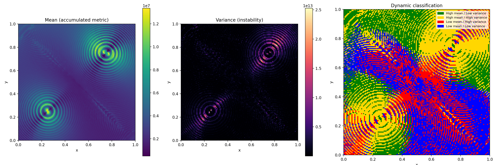

# Chaotic 3-Body Simulation (Batch + Spatial Analysis)

This project implements a batch-based numerical simulation of a simplified
3-body gravitational system, with emphasis on chaotic dynamics, spatial
statistics, and reproducibility.

The objective is not astrophysical realism, but the generation of a rich
dynamical phase space from which spatial patterns, instability regions, and
emergent structure can be analyzed.

--------------------------------------------------------------------------

OVERVIEW

The pipeline is divided into three stages:

1) Simulation (main.py)
   - Samples large numbers of initial conditions for a third body
   - Runs a deterministic 3-body interaction model
   - Accumulates a scalar metric based on visited spatial grid cells
   - Writes results to disk in Parquet format (batch-wise)

2) Analysis (src/analysis.py)
   - Computes spatial mean and variance on a 2D grid
   - Masks empty regions
   - Classifies regions using median-based thresholds

3) Visualization (visualize.py)
   - Generates heatmaps and categorical phase maps
   - Saves figures together with full metadata snapshots
   - Ensures reproducibility and auditability

--------------------------------------------------------------------------

PROJECT STRUCTURE

.
├── main.py                Dataset generation (simulation)
├── visualize.py           Analysis, plotting, and metadata capture
├── requirements.txt
├── LICENSE
├── README.md
├── src/
│   ├── config.py          All simulation parameters (single source of truth)
│   ├── physics.py         Numba-accelerated physics engine
│   ├── analysis.py        Grid statistics and classification
│   ├── plotting.py        Visualization utilities
│   ├── run_metadata.py    Reproducibility helpers (git, config, env)
│   └── __init__.py
└── outputs/               Auto-generated visualization runs (git-ignored)

--------------------------------------------------------------------------

PHYSICS MODEL (HIGH-LEVEL)

- Three bodies with configurable masses (defaults to unit mass)
- Pairwise inverse-square force (scaled by G) with a softening factor to avoid singularities
- Fixed time-step integration
- Two bodies start at fixed positions and velocities
- The third body is sampled uniformly over a 2D domain
- A scalar value is accumulated based on visited grid cells
- Bodies are ejected when leaving the domain (current boundary model)

This setup is intentionally minimal and designed to exhibit strong sensitivity
to initial conditions.

--------------------------------------------------------------------------

NUMERICAL INTEGRATION

The integration method is configurable via src/config.py:

INTEGRATOR = "euler"    options: euler | rk4 | verlet

- Euler integration is currently implemented
- RK4 and Velocity Verlet are structurally supported and planned
- Integration is performed using Numba for parallel execution

--------------------------------------------------------------------------

CONFIGURATION

All parameters that affect the simulation live in src/config.py and follow an
ALL_CAPS convention.

Examples:
- GRID_SIZE            (Simulation domain grid resolution)
- VISUAL_GRID_SIZE     (Analysis and plotting grid resolution)
- TIME_STEPS           (Duration of each simulation)
- DT                   (Integration time step)
- INTEGRATOR           (e.g., "euler")
- SOFTENING_FACTOR     (Physics parameter to avoid singularities)
- MASSES               (Mass of each of the three bodies)

All configuration values are automatically snapshotted during visualization.

--------------------------------------------------------------------------

RUNNING THE SIMULATION

Install dependencies:

pip install -r requirements.txt

Generate the dataset:

python main.py

This creates Parquet files in:

data/raw/
  batch_00000.parquet
  batch_00001.parquet
  ...

Each file contains:
- x, y: initial position
- A metric column (e.g., "total_sum"): accumulated dynamical metric. The column name is configurable in src/config.py via METRIC_COLUMN_NAME.

--------------------------------------------------------------------------

VISUALIZATION AND REPRODUCIBILITY

Run:

python visualize.py

Each run creates a timestamped directory:

outputs/vis_YYYY-MM-DD_HH-MM-SS/

Containing:
- figure.png
- config_snapshot.json   (A complete snapshot of all parameters from src/config.py)
- run_info.json          (Metadata about the visualization run itself, e.g., git commit, data paths)
- git_commit.txt
- git_status_porcelain.txt
- pip_freeze.txt

This allows exact reconstruction of any figure.

--------------------------------------------------------------------------

OUTPUT PLOTS

The visualization includes:
1) Spatial mean map
2) Spatial variance map
3) Categorical phase classification map:
   - High mean / low variance
   - High mean / high variance
   - Low mean / high variance
   - Low mean / low variance

These regions can be interpreted as distinct dynamical regimes.

--------------------------------------------------------------------------

DESIGN PHILOSOPHY

- Deterministic, batch-oriented simulations
- Explicit parameterization
- No hidden global state
- Reproducibility over convenience
- Performance-aware (Numba, Parquet, vectorized workflows)

--------------------------------------------------------------------------

STATUS

This project is experimental and exploratory.
The physics model, boundary conditions, and numerical methods are expected to
evolve.

--------------------------------------------------------------------------

LICENSE

MIT License.
